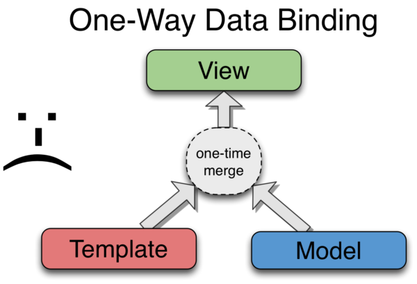

Introducere în AngularJS
========================

Radu Potop

--------------------------

AngularJS
=========

* A Javascript MVC framework
* Made by Google

Features
========

* two-way data binding
* routing
* modules
* directives
* testing
* makes large apps maintainable

--------------------------

**WHAT** are you talking about??
============================

Cum am ajuns aici?  
De ce e atât de complicat?

--------------------------

Un pic de istorie
-----------------

* La începuturile web-ului: give me a doc!

--------------------------

* Server-side apps au evoluat
* Give me a fragment!

--------------------------

* Evoluția pe server-side: Scripts -> Frameworks MVC
* HTML -> JSON
* Folosim tot jQuery

--------------------------

* Pe client-side: jQuery -> Javascript MVC Framework (Single Page Apps)
* Am renunțat la Views pe server-side

--------------------------

Tell me more
============

--------------------------

AngularJS
=========

A Javascript MVC framework

SPA - Single Page Applications

Features
========

* two-way data binding
* routing
* modules
* templates
* directives
* testing
* makes large apps maintainable

--------------------------

SPA
===

Single Page Applications

* Aplicații dinamice
* O singură pagină HTML care încarcă o aplicație Javascript unitară
* Self-contained: își păstrează state-ul între rute
* Încarcă dinamic clase, views, assets
* Folosesțe o formă de routing
* No refresh
* Face apeluri la un API REST pentru date

## Highly dynamic apps: html pages -> web apps

--------------------------

MVC
===

Model-View-Controller pattern:

* separation of concerns (layers)
* Model = data layer, ne servește datele de la server
* View = presentation layer
* Controller = business logic (leaga Model si View)

AngularJS - lot more than MVC:

* HTML enhanced for web apps
* AngularJS lets you extend HTML vocabulary for your application

## Folosind MVC -> aplicațiile mari devin maintainable

--------------------------

Two-way data binding
====================

Modificările din model se propagă instant în view și invers.

Model <---> View

* Modelul este sincronizat cu View
* Scope = un obiect care leagă Model și View

## Ne scutește de sincronizarea datelor cu prezentarea și invers
## SPOT - Single Point Of Truth

	JS:
	
    $scope.name = 'steve';
    
    HTML:
    
    <input type="text" ng-model="name">

--------------------------

--------------------------

--------------------------

Routing
=======

* Încarcă clase / controllere în funcție de ruta accesată
* Se face prin hash part al URL-ului

De exemplu ruta `#/campaign/1` va arăta spre controllerul `campaigns(1)` și spre template-ul `campaigns.html`
	
	#/campaign/1 -> campaigns(1){
		...
	};
	

## Routes permit navigarea prin aplicație si deep-linking la pagini

--------------------------

Modules / Servicii
==================

Unitati care incapsuleaza o functionalitate bine definita - **clase**

Putem crea propriile servicii
-----------------------------

* chart
* pagination
* validation
* usernotify

Many built-in services
----------------------

* xhr, resource, route, location, 

## Contained, reusable code, DRY -> Don't Repeat Yourself

--------------------------

Dependency Injection
====================

* Serviciile sunt injected in controllere
* Un mod de a rezolva dependințele
* Pot fi mocked pentru testare
* Înlocuind serviciile cu dummy services
* Named parameters

## Testable, mockable code

* [The "Magic" behind AngularJS Dependency Injection](http://www.alexrothenberg.com/2013/02/11/the-magic-behind-angularjs-dependency-injection.html)

--------------------------

Directive
=========

Sau widgets, components

* Augmenteaza codul HTML prin elemente sau atribute definite de catre developer.
* Manipularea de DOM se realizeaza in interiorul directivelor
* Pentru a nu avea DOM manip peste tot în cod

Ex:
	
	<input type="text" name="date" date-picker>
	

	
## DOM manip is contained, reusable directives în views, DRY

--------------------------

Templates
=========

* Templates sunt populate cu date din model
* Declarative is better than procedural
* Less DOM manipulation

Template

	{{phone.name}}
	
Loops

	

		{{phone.name}}
	

Filtre
======
	
	{{15.05 | number}}
	{{'2013-05-13' | date}}
	
Directive

--------------------------

Cum funcționează împreună?
==========================

* aplicația pornește printr-un atribut special pe elementul `<html>` (bootstrapped)
* sunt lansate serviciile
* sunt pornite controllerele în funcție de rută
* sunt compilate templates și directivele în views
* se face two-way data binding între modele și views prin intermediul scope

--------------------------

Okay, cool
==========

--------------------------

Case study: Sendmachine
========================

Ce are special Sendmachine?

--------------------------

ACL service + Session service
=============================

* Permite accesul userului în funcție de credențiale / grup
* Accesul este pe routes

Grupuri:

* guest - [/login, /register]
* new - [/confirm_email, /myaccount]
* confirmed - [*]
* expired

--------------------------

Form Validation service
=======================

* rulează **aceleași** reguli atât pe front-end cat si pe back-end
* regulile folosite de backend pentru validare sunt expuse printr-un API RESTful și refolosite de către front-end pentru validarea forms
* chained rules:
	* required | valid_email | email_exists_callback
	

	
Directive
=========
	
	<input name="form.email" type="email" validation>
	
	<input name="form.password" type="password" validation>
	
--------------------------

Chart service
=============

* wraps Highcharts
* timeseries pe luni / zile / ore
* polling
* getPeriod: today, last_24_hours, yesterday, last_30_days

* Polling service doar cand pagina este vizibila - cu [Page Visibility API](https://developer.mozilla.org/en-US/docs/Web/Guide/User_experience/Using_the_Page_Visibility_API)

--------------------------

Lang service
============

* Localizare
* limba + locale poate fi schimbata on the fly

Filters
=======

* date - locale aware
* numbers - locale aware

--------------------------

Permalink service
=================

* Deeplink - linkuire la o anumită stare a aplicației
* Permalink per resursa / serviciu

&nbsp;

	#/campaigns?c_orderby=cdate&c_offset=20
.

--------------------------

Shared bundles
==============

* servicii + directive + helpers = bundle
* bundles shared între aplicații
* Sendmachine <---> intranet app <---> hosting app

--------------------------

Directives
==========

Pagination 

	

IDE (ACE)

	

WYSIWYG

	

	
Validation

	<input name="form.email" type="email" validation>

--------------------------

But wait there's more
=====================

--------------------------

The future
==========

ECMAScript 6 va implementa:

* modules - modules în AngularJS
* named parameters - Dependency Injection în AngularJS
* observers - two-way data binding

HTML va implementa:

* templates
* components = directives în AngularJS

* Echipa AngularJS lucrează împreuna cu echipa Chromium (Google Chrome)
* Dezvoltă AngularJS a.î. să se muleze pe viitoarele standarde JS/HTML
* Tools: Batarang, Webstorm extension, tutoriale

--------------------------

Mulțumesc
=========

[https://github.com/wooptoo/introducere_in_angularjs](https://github.com/wooptoo/introducere_in_angularjs)
