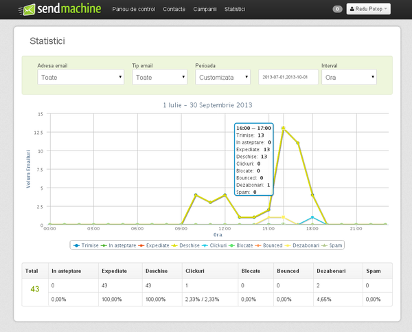

Introducere în AngularJS
========================

Radu Potop

--------------------------

AngularJS
=========

* A Javascript MVC framework
* Made by Google

Features
========

* two way data binding
* routing
* modules
* directives
* testing
* makes large apps maintainable

--------------------------

WHAT??
======

Cum am ajuns aici?

--------------------------

Un pic de istorie
-----------------

* La inceputurile web-ului: give me a doc!

--------------------------

* Server-side apps au evoluat
* Give me a fragment!

--------------------------

* Evolutia pe server-side: Scripts -> Frameworks MVC
* HTML -> JSON
* Folosim tot jQuery

--------------------------

* Am renunțat la Views pe server-side
* Codul pentru a asambla pagini: jQuery -> Javascript MVC Framework -> Single Page Apps

--------------------------

--------------------------

AngularJS
=========

A Javascript MVC framework

SPA - Single Page Applications

* two way data binding
* routing
* modules
* templates
* directives
* testing
* makes large apps maintainable

--------------------------

MVC
===

Model-View-Controller pattern:

* separation of concerns (layers)
* Model = data layer
* View = presentation layer
* Controller = business logic (leaga Model si View)

A lot more than MVC:

* HTML enhanced for web apps
* AngularJS lets you extend HTML vocabulary for your application.

## MVC makes large apps maintainable prin separarea layerelor

--------------------------

Two way data binding
====================

Modificarile din model se propaga instant in view, si invers.

Model <---> View

* Modelul este sincronizat cu View
* Scope = un obiect care leagă Model și View
* Scope are anumite metode: $watch, $get, $set

## Ne scutește de la sincronizarea datelor cu prezentarea și invers

--------------------------

Routing
=======

Încarcă clase/controllere în funcție de link-ul accesat  
Prin hash part al URL-ului

De exemplu ruta `#/campaign/1` va arăta spre controllerul `campaigns(1)` și spre template-ul `campaigns.html`
	
	#/campaign/1 -> campaigns(1){
		...
	};
	

## 

--------------------------

Modules / Servicii
==================

Unitati care incapsuleaza o functionalitate bine definita - **clase**

Servicii
--------

* chart
* pagination
* date picker
* etc.

Many built-in services
----------------------

* xhr, resource, route, location, 

## Contained, reusable code

--------------------------

Dependency Injection
====================

* Serviciile sunt injected in controllere
* Pot fi mocked pentru testare
* Named parameters

## Testable, mockable

* The "Magic" behind AngularJS Dependency Injection: [http://www.alexrothenberg.com/2013/02/11/the-magic-behind-angularjs-dependency-injection.html](http://www.alexrothenberg.com/2013/02/11/the-magic-behind-angularjs-dependency-injection.html)

--------------------------

Directive
=========

* Augmenteaza codul HTML prin elemente sau atribute definite de catre developer.
* Manipularea de DOM se realizeaza in interiorul directivelor
* pentru a nu avea DOM manip in controllere si in tot codul.

Ex:
	
	<input type="text" name="date" date:picker>
	
	
## Less DOM manipulation, DOM manip is contained

--------------------------

Templates
=========

Template

	{{phone.name}}
	
Loops

	

		{{phone.name}}
	

Filtre
	
	{{15.05 | number}}
	{{'2013-05-13' | date}}
	
etc.

* Declarative is better than procedural

--------------------------

Cum funcționează împreună?
==========================

* aplicația pornește printr-o directivă / un atribut special
* sunt lansate serviciile
* sunt pornite controllerele in functie de ruta curentă
* sunt compilate templates/views care conțin directivele
* se face two way data binding intre modele si views prin intermediul scope

--------------------------

--------------------------

Case study: Sendmachine
========================

Ce are special Sendmachine?

--------------------------

ACL service + Session service
=============================

* permite accesul pe routes in functie de credentiale/grup

Grupuri:

* guest
* new
* confirmed
* expired

* in caz de 401 pe orice resursa esti scos din aplicatie

--------------------------

Form Validation service
=======================

* rulează **aceleași** reguli atât pe front-end cat si pe back-end
* regulile folosite de backend pentru validare sunt expuse printr-un API RESTful si refolosite de catre front-end pentru validarea forms
* chained rules:
	* required | valid_email | existing_email

--------------------------

Storage + Request Cache
=======================

* stocheaza în local storage datele dintr-un form
* in cazul unui 401, 403 sa poti recupera datele introduse

--------------------------

Lang service
============

* Localizare
* limba + locale poate fi schimbata on the fly

--------------------------

Permalink service
=================

* Deeplink
* linkuire la o anumita stare a aplicatiei

--------------------------

Chart service
=============

* wraps Highcharts
* timeseries pe luni / zile / ore
* polling
* getPeriod: today, last_24_hours, yesterday, last_30_days

--------------------------

Directives
==========

* pagination
* editor (ACE)

	code here

--------------------------

Filters
=======

* date (locale aware)
* numbers (locale aware)

--------------------------

--------------------------

The future
==========

ECMAScript 6 va implementa:

* modules - modules în AngularJS
* named parameters - Dependency Injection în AngularJS
* observers - two-way data binding

HTML va implementa:

* templates
* components = directives în AngularJS

* Echipa AngularJS lucrează împreuna cu echipa Chromium (Google Chrome)
* Urmăresc dezvoltarea AngularJS a.î. să se muleze pe viitoarele standarde JS/HTML

--------------------------

So why use AngularJS?
=====================

* makes large apps maintainable
* less DOM manipulation

--------------------------

Mulțumesc
=========

[https://github.com/wooptoo/introducere_in_angularjs](https://github.com/wooptoo/introducere_in_angularjs)
